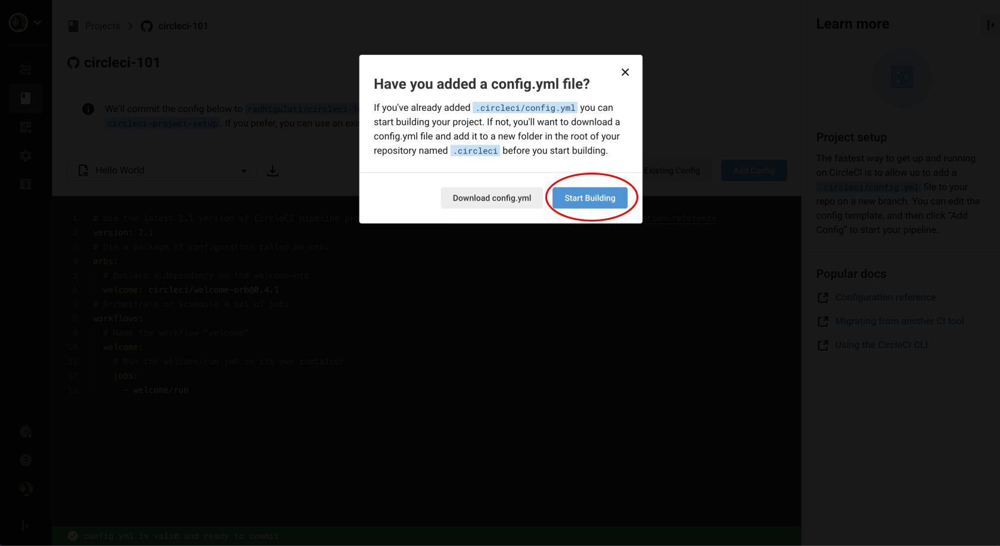

---?image=images/continuous-integration-with-circle-ci.png&position=center&size=auto 70%
@title[Intro]
@snap[north span-100]
#### Development Roundtable Presents:
@snapend

---
@title[Prereqs1]

@snap[north-west]
#### Prereqs
@snapend

@snap[west span-100]
@ul[spaced]
- Some basic knowledge of git and an existing GitHub.com account *(also fine for people to create an account at the beginning of class)*
- Some basic terminal or bash know-how is helpful. Prior experience using the command line comes in handy. We will be using a JavaScript project in our example. But no worries, there is no need to know all the ins-and-outs of JavaScript :relieved:
@ulend
@snapend
---
@title[Prereqs2]

@snap[north-west]
#### Prereqs Continued
@snapend

@snap[west span-100]
@ul[spaced]
- It is necessary to have your GitHub.com SSH Keys setup for the SSH-ing into your build section. The information you need for that is [here](https://help.github.com/articles/connecting-to-github-with-ssh/)
@ulend
@snapend
---
@title[WhatIsCI1]

@snap[north-west]
#### What is Continuous Integration? 
@snapend


@snap[west span-100]
**Continuous Integration** is a practice that encourages developers to integrate their code into a `master` branch of a shared repository early and often. Instead of building out features in isolation and integrating them at the end of a development cycle, code is integrated with the shared repository by each developer multiple times throughout the day.
@snapend
---
@title[WhatIsCI2]

@snap[north-west]
#### What is Continuous Integration? Continued
@snapend

@snap[west span-100]
@ul[spaced]
**What?**    
- Every developer commits daily to a shared mainline. Every commit triggers an automated build and test. If build and test fails, it’s repaired quickly - within minutes.  
**Why?**    
- Improve team productivity, efficiency, happiness. Find problems and solve them, quickly. Release higher quality, more stable products.
@ulend
@snapend
---
@title[CircleCIAmIRight]

@snap[midpoint span-100]
## CircleCI
**CircleCI** - Our mission is to empower technology-driven organizations to do their best work.  
We want to make engineering teams more productive through intelligent automation.
@snapend
---
@title[AdvantagesCI]

@snap[north-west]
#### Advantages of Continuous Integration
@snapend

@snap[west span-100]
@ul[spaced]
Continuous Integration allows organizations to: 
- Improve team productivity and efficiency
- Accelerate time to market
- Release higher quality, more stable products
- Increase customer satisfaction
- Keep developers happy, and shipping code
@ulend
@snapend
---
@title[MoreLoveForCircleCI]

@snap[north-west span-100]
#### CircleCI provides Enterprise-class support + services, with the flexibility of a startup. 
@snapend

@snap[west span-100]
- We work where you work: Linux, macOS, Android - SaaS or behind your firewall.  
- Leverage the opportunities created by your modern Git repos.  
- Set up in minutes out of the box, or fully customize to suit your needs.* 
@snapend
---
@title[FirstCircleCIBuild]

@snap[north-west span-100]
#### First CircleCI Build: Let's try out something simple
@snapend

@snap[west span-100]
@ul[spaced]
#### Creating a repository 
- Navigate to your account on GitHub.com 
- Go to the **Repositories** tab and then select **New**
- Alternatively you can navigate directly to https://github.com/new

@ulend
@snapend
---?image=images/create-repo-circle-101-initialise-readme.png&position=center&size=auto 70%
@title[FirstCircleCIBuildCont]

@snap[north-west span-100]
#### First CircleCI Build: Continued
@snapend
---
@title[AddingAYAML]

@snap[north-west span-100]
#### Adding a .yml file
@snapend

@snap[west span-100]
CircleCI uses a [YAML](https://en.wikipedia.org/wiki/YAML) file to identify how you want your testing environment setup and what tests you want to run.
@snapend
---
@title[AddingAYAMLCont]

@snap[north-west span-100]
#### Adding a .yml file Continued
@snapend

@snap[west span-100]
On CircleCI 2.0, this file must be called `config.yml` and must be in a hidden folder called `.circleci` (on Mac, Linux, and Windows systems, files and folders whose names start with a period are treated as system files that are hidden from users by default).
@snapend
---
@title[StepsYAML1]

@snap[north-west span-100]
#### Adding a .yml file Continued
@snapend

@snap[west span-100]
@ul[spaced]
- To create the file and folder on GitHub, click the **"Create new file"** button the repo page and type `.circleci/config.yml`.
- You should now have in front of you a blank `config.yml` file in a `.circleci` folder.
- To start out with a simple config.yml, copy the text below into the file editing window on GitHub:
@ulend
@snapend
---
@title[StepsYAML2]

@snap[north-west span-100]
#### Adding a .yml file Continued
@snapend

```yml
version: 2
jobs:
  build:
    docker:
      - image: circleci/ruby:2.4.1
    steps:
      - checkout
      - run: echo "A first hello"
```
---
@title[StepsYAML3]

@snap[north-west span-100]
#### Adding a .yml file Continued
@snapend

@snap[west span-100]
@ul[spaced]
- The `- image: circleci/ruby:2.4.1` text tells CircleCI what Docker image to use when it builds your project.
- Circle will use the image to boot up a "container" — a virtual computing environment
- CircleCI provides images for most every language)[https://circleci.com/docs/2.0/circleci-images/] based on popular community images.
@ulend
@snapend
---
@title[SettingUpBuild1]

@snap[north-west span-100]
#### Setting up your build on CircleCI
@snapend

- For this step, you will need a CircleCI account.
- Visit https://circleci.com/signup and click "Start with GitHub".
- You will need to give CircleCI access to your GitHub account in order to run your builds. 
- If you already have a CircleCI account then you can navigate to your dashboard: https://circleci.com/dashboard

---
@title[SettingUpBuild2]

#### To add your new repo, ensure that your GitHub account is selected in the dropdown in the upper-left, find the repository you just created below, and click the "Setup project" button next to it.


---
@title[SettingUpBuild3]

#### On the next screen, you're given some options for configuring your project on CircleCI. For now leave everything as-is for now and just click the "Start building" button a bit down the page on the right.


---
#### Running your first CircleCI build!

You should see your build start to run automatically—and pass! So, what just happened? Click on the green button and let's investigate.

1. **Spin up environment:** CircleCI used the `circleci/ruby:2.4.1` Docker image to launch a virtual computing environment.
---
#### Running your first CircleCI build continued!

2. **Checkout code:** CircleCI checked out your GitHub repository and "cloned" it into the virtual environment launched in step 1

3. **echo:** this was the only other instruction in your `config.yml` file: CircleCI ran the echo command with the input "A first hello" ([echo](https://linux.die.net/man/1/echo) does exactly what you'd think it would do)
---
#### Running your first CircleCI build continued!
#### Even though there was no actual source code in your repo, and no actual tests configured in your `config.yml`, CircleCI considers your build to have "succeeded" because all steps completed successfully (returned an [exit code](https://en.wikipedia.org/wiki/Exit_status) of 0).
---
#### Breaking your build!
#### Edit your `config.yml` file (you can just do this in the GitHub editor for simplicity) and replace `echo "A first hello"` with `notacommand`. Commit and push this change (or just hit "Commit" in the GitHub editor) to trigger a new build and see what happens!
---
#### Using Workflows

To see Workflows in action we can edit our `.circle/config.yml` file. Once you have the file in edit mode in your browser window, select the text from `build` and onwards in you file and copy and paste the text to duplicate that section.
---
#### Using Workflows Continued with YAML
```yml
version: 2
jobs:
  build:
    docker:
      - image: circleci/ruby:2.4.1
    steps:
      - checkout
      - run: echo "A first hello"
  build:
    docker:
      - image: circleci/ruby:2.4.1
    steps:
      - checkout
      - run: echo "A first hello"      
```
---
#### Using Workflows Continued with YAML
#### We need to add a `workflows` section to our config file.
```yml
version: 2
jobs:
  build:
    docker:
      - image: circleci/ruby:2.4.1
    steps:
      - checkout
      - run: echo "A first hello"
      - run: sleep 5
  test:
    docker:
      - image: circleci/ruby:2.4.1
    steps:
      - checkout
      - run: echo "A more familiar hi"
      - run: sleep 5
workflows:
  version: 2
  build_and_test:
    jobs:
      - build
      - test
```
---
#### Commit these changes to your repository and navigate back over to the CircleCI dashboard. 


---
#### And drilling a little deeper into our workflow...


---
#### Using Workflows Continued with YAML
#### Since we want our jobs to run sequentially, we add the `requires` directive.
```yml
version: 2
jobs:
  build:
    docker:
      - image: circleci/ruby:2.4.1
    steps:
      - checkout
      - run: echo "A first hello"
      - run: sleep 5
  test:
    docker:
      - image: circleci/ruby:2.4.1
    steps:
      - checkout
      - run: echo "A more familiar hi"
      - run: sleep 5
workflows:
  version: 2
  build_and_test:
    jobs:
      - build
      - test:
          # only run this job if build succeeds
          requires:
            - build 
```
---
#### Adding some changes to use Workspaces 
- Each Workflow has an associated Workspace which can be used to transfer files to downstream jobs as the workflow progresses.
- You can use workspaces to pass along data that is unique to this run and which is needed for downstream jobs. Try updating `config.yml` to the following:
---
#### Adding some changes to use Workspaces Continued
```yml
version: 2
jobs:
  build:
    docker:
      - image: circleci/ruby:2.4.1
    steps:
      - checkout
      - run: mkdir -p my_workspace
      - run: echo "Hello World" > my_workspace/echo-output
      - persist_to_workspace:
          # Must be an absolute path, or relative path from working_directory
          root: my_workspace
          # Must be relative path from root
          paths:
            - echo-output      
  testa:
    docker:
      - image: circleci/ruby:2.4.1
    steps:
      - attach_workspace:
          # Must be absolute path or relative path from working_directory
          at: my_workspace

      - run: cat my_workspace/echo-output
          
  testb:
    docker:
      - image: circleci/ruby:2.4.1
    steps:
      - attach_workspace:
          # Must be absolute path or relative path from working_directory
          at: my_workspace

      - run: |
          # this will fail intentionally, we'll use SSH to debug and fix
          if [[ $(cat my_workspace/echo-output) == "Trying out workspaces" ]]; then
            echo "It worked!";
          else
            echo "Nope!"; exit 1
          fi   
          
  deploy:
    docker:
      - image: circleci/ruby:2.4.1
    steps:
      - attach_workspace:
          # Must be absolute path or relative path from working_directory
          at: my_workspace

      - run: |
          echo "Deploying message!"
          cat my_workspace/echo-output

workflows:
  version: 2
  build_and_test:
    jobs:
      - build
      - testa:
          requires:
            - build 
      - testb:
          requires:
            - build 
      - deploy:
          requires:
            - testa
            - testb
```
---
#### Adding some changes to use Workspaces Continued
- **NOTE**: Uh-oh, our `testb` job failed, blocking our deployment.  Can you use SSH debugging (below) to find the right fix?  Hint: Try to run the `at my_workspace/echo-output` yourself, what is the output?
- You can read more about Workspaces here: https://circleci.com/docs/2.0/workflows/#using-workspaces-to-share-data-among-jobs
---
#### SSH'ing into your build

- For those who are comfortable with the terminal, you can SSH directly into your CircleCI jobs to troubleshoot issues with your builds by rerunning your build with the SSH enabled option. 
- Note that you will need to add your SSH keys to your GitHub account:
https://help.github.com/articles/connecting-to-github-with-ssh/*


---
#### SSH'ing into your build Continued


---
#### SSH'ing into your build Continued


---
#### SSH'ing into your build Continued

- Copy the `ssh` string from the enabling SSH section of your build. Open a terminal and paste in the `ssh` string. 
- Some of the following shell commands are helpful:
```
pwd     #  print what directory, find out where you are in the file system
ls -al   # list what files and directories are in the current directory
cd <directory_name>    # change directory to the <directory_name> directory 
cat <file_name>    # show me the contents of the file <file_name>
```
---
#### Further resources/links

- Blog post on how to validate the CircleCI `config.yml` on every commit with a git hook - *extra credit* https://circleci.com/blog/circleci-hacks-validate-circleci-config-on-every-commit-with-a-git-hook/
---
#### References: CircleCI

- The CircleCI blog and how to follow it https://circleci.com/blog/
- Relavant blog post https://circleci.com/blog/what-is-continuous-integration/
- Our other social media and GitHub
  - https://github.com/circleci
  - https://twitter.com/circleci
  - https://www.facebook.com/circleci
---
#### References: Continuous Integration

- https://martinfowler.com/articles/continuousIntegration.html
- https://en.wikipedia.org/wiki/Continuous_integration#Best_practices
---
#### References: YAML
- https://en.wikipedia.org/wiki/YAML#Advanced_components