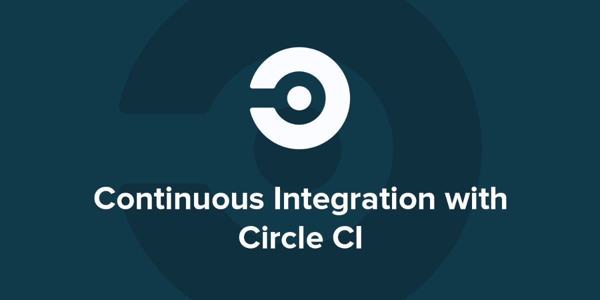
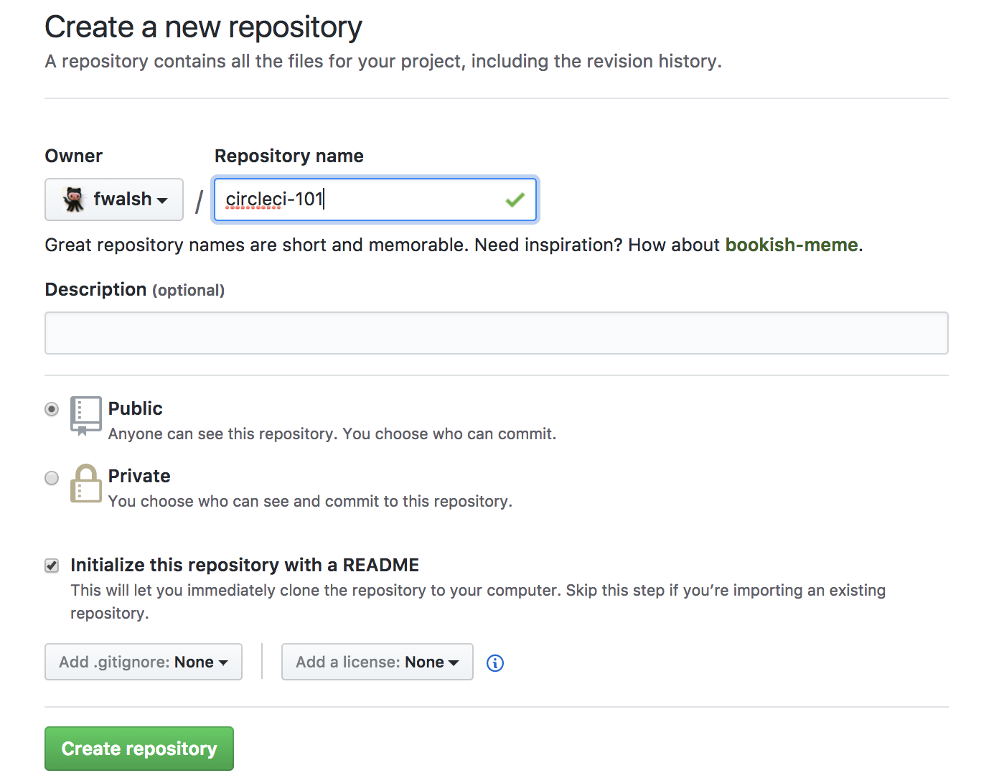
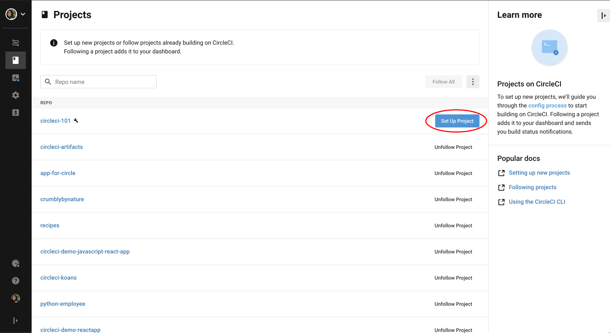
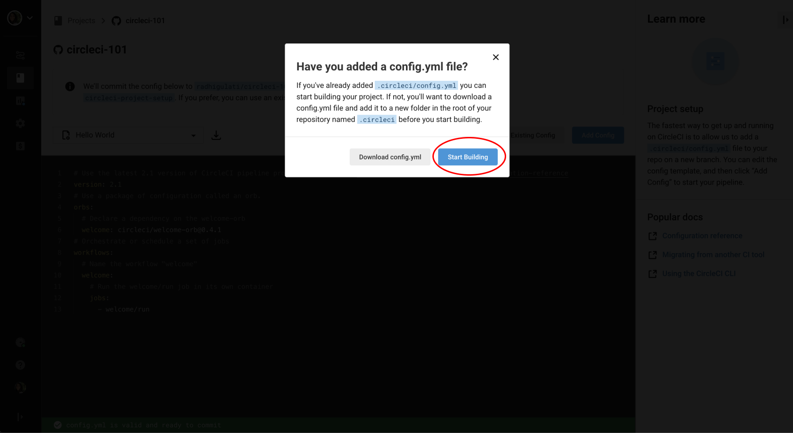
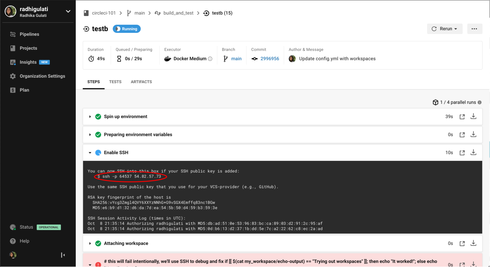

# CircleCI Lunch and Learn


# CircleCI 101 - Lunch and learn  

## Prereqs 

* Some basic knowledge of git and an existing GitHub.com account *(also fine for people to create an account at the beginning of class)*
* Some basic terminal or bash know-how is helpful. Prior experiance using the command line comes in handy. We will be using a Java Script project in our example. But no worries, there is no need to know all the ins-and-outs of Java Script :relieved:

## What is Continuious Integration? 

**Continuous integration** is a practice that encourages developers to integrate their code into a 'master' branch of a shared repository early and often. Instead of building out features in isolation and integrating them at the end of a development cycle, code is integrated with the shared repository by each developer multiple times throughout the day.


## What is CircleCI?  

CircleCI integrates with a VCS (Version Control System) and automatically runs a series of steps every time that it detects a change to your repository. The CI stands for Continuous Integration. ... The benefit of continuous integration is that micro updates to the code base are far easier to merge and integrate than large ones, and the frequency with which the micro updates are pushed and pulled ensures that everyone's local version is more or less the same.

## First CircleCI Build
#### :computer: Let's try out something simple to start off with
### Creating a repository 
* Navigate to your account on GitHub.com 
  * Go to the **Repositories** tab and then select **New**
  * Alternatively you can navigate directly to https://github.com/new



### Adding a .yml file

CircleCI uses a [YAML](http://yaml.org/) file to identify how you want your testing environment setup and what tests you want to run.
On CircleCI 2.0, this file must be called `config.yml` and must be in a hidden folder called `.circleci` (on Mac, Linux, and Windows systems, files and folders whose names start with a period are treated as system files that are hidden from users by default).

 * To create the file and folder on GitHub, click the **"Create new file"** button the repo page and type `.circleci/config.yml`.
  
 * You should now have in front of you a blank `config.yml` file in a `.circleci` folder.

* To start out with a simple config.yml, copy the text below into the file editing window on GitHub:

```yml
version: 2
jobs:
  build:
    docker:
      - image: circleci/ruby:2.4.1
    steps:
      - checkout
      - run: echo "A first hello"
```
      
The `- image: circleci/ruby:2.4.1` text tells CircleCI what Docker image to use when it builds your project. Circle will use the image to boot up a "container" — a virtual computing environment where it will install any languages, system utilities, dependencies, web browsers, etc., that your project might need in order to run.

### Setting up your build on CircleCI

For this step, you will need a CircleCI account. Visit https://circleci.com/signup and click "Start with GitHub". You will need to give CircleCI access to your GitHub account in order to run your builds. 

If you already have a CircleCI account then you can navigate to your dashboard: https://circleci.com/dashboard

Next, you will be given the option of "following" any projects you have access to that are already building on CircleCI (this would typically apply to developers connected to a company or organization's GitHub/Bitbucket account). Since this probably doesn't apply to you, click "Skip - I don't want to follow any projects." On the next screen, you'll be able to add the repo you just created as a new project on Circle.

To add your new repo, ensure that your GitHub account is selected in the dropdown in the upper-left, find the repository you just created below, and click the "Setup project" button next to it.



On the next screen, you're given some options for configuring your project on CircleCI. Leave everything as-is for now and just click the "Start building" button a bit down the page on the right.




### Running your first CircleCI build!

You should see your build start to run automatically—and pass! So, what just happened? Click on the green button and let's investigate.

1. **Spin up environment:** CircleCI used the `circleci/ruby:2.4.1` Docker image to launch a virtual computing environment.

2. **Checkout code:** CircleCI checked out your GitHub repository and "cloned" it into the virtual environment launched in step 1

3. **echo:** this was the only other instruction in your `config.yml` file: CircleCI ran the echo command with the input "A first hello" ([echo](https://linux.die.net/man/1/echo) does exactly what you'd think it would do)

Even though there was no actual source code in your repo, and no actual tests configured in your `config.yml`, CircleCI considers your build to have "succeeded" because all steps completed successfully (returned an [exit code](https://en.wikipedia.org/wiki/Exit_status) of 0). Most customers' projects are far more complicated, oftentimes with multiple Docker images and multiple steps, including a large number of tests—here's an example. You can learn more about all the possible steps one might put in a `config.yml` file [here](https://circleci.com/docs/2.0/configuration-reference).

### Breaking your build!

Edit your `config.yml` file (you can just do this in the GitHub editor for simplicity) and replace `echo "A first hello"` with `notacommand`. Commit and push this change (or just hit "Commit" in the GitHub editor) to trigger a new build and see what happens!


### Using the workflows functionality 

To see workflow in action we can edit our `.circle/config.yml` file. Once you have the file in edit mode in your browser window, select the text from `build` and onwards in you file and copy and paste the text to duplicate that section.

That should look similar to the code block below:

```yml
version: 2
jobs:
  build:
    docker:
      - image: circleci/ruby:2.4.1
    steps:
      - checkout
      - run: echo "A first hello"
  build:
    docker:
      - image: circleci/ruby:2.4.1
    steps:
      - checkout
      - run: echo "A first hello"      
```

Next we need to rename our two builds so that they have different names. In my example below I imaginatively picked `one` and `two`. Change the contents of the echo statements to something differnt. To make the build take a longer period of time we can add a system sleep command. 

We need to add a `workflows` section to our config file. The workflows section can be placed anywhere in the file. Typically it is found either at the top or the bottom of the file. 


```yml
version: 2
jobs:
  one:
    docker:
      - image: circleci/ruby:2.4.1
    steps:
      - checkout
      - run: echo "A first hello"
      - run: sleep 25
  two:
    docker:
      - image: circleci/ruby:2.4.1
    steps:
      - checkout
      - run: echo "A more familiar hi"
      - run: sleep 15
workflows:
  version: 2
  one_and_two:
    jobs:
      - one
      - two
```

Commit these changes to your repository and navigate back over to the CircleCI dashboard. 


And drilling a little deeper into our workflow..


You can read more about workflows here: https://circleci.com/docs/2.0/workflows/#overview

### Adding some changes to use the workspaces functionality 

Each workflow has an associated workspace which can be used to transfer files to downstream jobs as the workflow progresses. You can use workspaces to pass along data that is unique to this run and which is needed for downstream jobs. 

```yml
version: 2
jobs:
  one:
    working_directory: ~/circle101
    docker:
      - image: circleci/ruby:2.4.1
    steps:
      - checkout
      - run: echo "A first hello"
      - run: mkdir -p workspace
      - run: echo "Trying out workspaces" > workspace/echo-output
      - persist_to_workspace:
          # Must be an absolute path, or relative path from working_directory
          root: workspace
          # Must be relative path from root
          paths:
            - echo-output      
      - run: sleep 10      
  two:
    docker:
      - image: circleci/ruby:2.4.1
    steps:
      - checkout
      - run: echo "A more familiar hi"  
      - run: sleep 7
      - attach_workspace:
          # Must be absolute path or relative path from working_directory
          at: /tmp/workspace

      - run: |
          if [[ `cat /tmp/workspace/echo-output` == "Trying out workspaces" ]]; then
            echo "It worked!";
          else
            echo "Nope!"; exit 1
          fi
workflows:
  version: 2
  one_and_two:
    jobs:
      - one
      - two:
          requires:
            - one
```
            
You can read more about workspaces here: https://circleci.com/docs/2.0/workflows/#using-workspaces-to-share-data-among-jobs

### SSH-ing into your build


For those who are comfortable with the terminal, you can SSH directly into your CircleCI jobs to troubleshoot issues with your builds like this:




## Further resources & links :link:

### CircleCI

* The CircleCI blog and how to follow it
  * https://circleci.com/blog/
* Relavant blog post  
  * https://circleci.com/blog/what-is-continuous-integration/
* Our other social media and GitHub
  * https://github.com/circleci
  * https://twitter.com/circleci
  * https://www.facebook.com/circleci
  
### CI

* https://martinfowler.com/articles/continuousIntegration.html
* https://en.wikipedia.org/wiki/Continuous_integration#Best_practices
  
### YAML
* https://en.wikipedia.org/wiki/YAML#Advanced_components

### Terraform
* https://blog.gruntwork.io/an-introduction-to-terraform-f17df9c6d180

