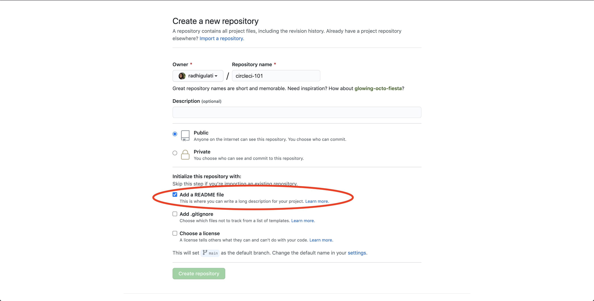

# circleci-lunch-learn
CircleCI Lunch and Learn


# CircleCI 101 - Lunch and learn :construction:

* ### :watch: *For a 60 - 90 minute interactive "training"* 
* ### :page_with_curl: *Format will be webpage or PDF*

## Outline the plan/flow of the lunch :bento: and learn :school:

### 1. Brief intros for whatever team members are present 

### 2. Prereqs 

* Some basic knowledge of git and an existing GitHub.com account *(also fine for people to create an account at the beginning of class)*
* Some basic terminal or bash know-how is helpful. Prior experiance using the command line comes in handy. We will be using a Java Script project in our example. But no worries, there is no need to know all the ins-and-outs of Java Script :relieved:

### 3. What is Continuious Integration? What is CD also (basic level)

### 4. What is CircleCI?  - *some marketing speak here*

### 5. First CircleCI Build
#### :computer: Let's try out something simple to start off with
##### Creating a repository 
* Navigate to your account on GitHub.com 
  * Go to the **Repositories** tab and then select **New**
  * Alternatively you can navigate directly to https://github.com/new


##### Adding a .yml file
 * CircleCI uses the .yml file to identify how you want your testing environment setup and what tests you want to run.
 * On CircleCI 2.0, this file must be called `config.yml` and must be in a hidden folder called `.circleci` (on Mac, Linux, and Windows systems, files and folders whose names start with a period are treated as system files that are hidden from users by default).

 * To create the file and folder on GitHub, click the **"Create new file"** button the repo page and type `.circleci/config.yml`.
  
 * You should now have in front of you a blank `config.yml` file in a .`circleci` folder.

* To start out with a simple config.yml, copy the text below into the file editing window on GitHub:

```
version: 2
jobs:
  build:
    docker:
      - image: circleci/<language>:<version TAG>
    steps:
      - checkout
      - run: echo "hello world"
      ```
      
The `<language>:<version TAG>` text tells CircleCI what Docker image to use when it builds your project. Circle will use the image to boot up a "container"—a virtual computing environment where it will install any languages, system utilities, dependencies, web browsers, etc., that your project might need in order to run.

For this example, replace the `<language>:<version TAG>` text with `ruby:2.3-node-browsers`. This would typically be used for a web application built with Ruby on Rails and Node.js. Then commit your new file.  
  
* Note: We are building on: https://github.com/iynere/circle-walkthru 
  * we want to show jobs and workflows in a simple example 

### 6. Forking an existing project to see some more CircleCI funtionality 
* Open to suggestion on what repo would be best for this section
* In George's GH training he uses:
  * https://github.com/GERey/github-games branch: unit-test *(which is pretty 1.0 centric)*
* Perhaps we can start with something simple, a simple 2.0 build and have then add workflows 
* Maybe use the same repo we use for demos instead of the above github-games
* Use our standard demo repo here - which is meant to show off a high-leven end-to-end 
* caching - tweak docker or some other improvment 
* SSH into the build 

#### Steps to include:
* Create a branch to work in their fork and make changes
* Issue a pull request with changes to initiate a CircleCI build

* Do something not supported or create a yaml typo and then fix that?
* Caching and Auto balancing?

### 7. Questions :speech_balloon:

### 8. Further resources links :link:
* would like some input from the team with resources they reference ofter or that they found really helpful along the way.
* This can be ordered into sections 
* #### CircleCI
* The CircleCI blog and how to follow it
  * https://circleci.com/blog/
* Relavant blog post  
  * https://circleci.com/blog/what-is-continuous-integration/
* Our other social media and GitHub
  * https://github.com/circleci
  * https://twitter.com/circleci
  * https://www.facebook.com/circleci
  
* #### CI
* https://martinfowler.com/articles/continuousIntegration.html
