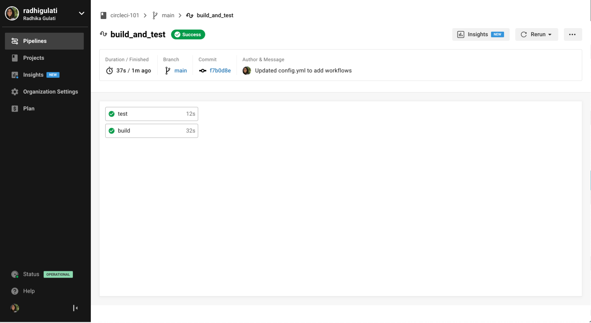

# CircleCI Lunch and Learn


# CircleCI 101 - Lunch and learn  

* ### :watch: *For a 60 - 90 minute interactive "training"* 
* ### :page_with_curl: *Format will be webpage or PDF*

## Outline the plan/flow of the lunch :bento: and learn :school:

### Prereqs 

* Some basic knowledge of git and an existing GitHub.com account *(also fine for people to create an account at the beginning of class)*
* Some basic terminal or bash know-how is helpful. Prior experiance using the command line comes in handy. We will be using a Java Script project in our example. But no worries, there is no need to know all the ins-and-outs of Java Script :relieved:

### What is Continuious Integration? What is CD also (basic level)

### What is CircleCI?  - *some marketing speak here*

### First CircleCI Build
#### :computer: Let's try out something simple to start off with
#### Creating a repository 
* Navigate to your account on GitHub.com 
  * Go to the **Repositories** tab and then select **New**
  * Alternatively you can navigate directly to https://github.com/new


#### Adding a .yml file

CircleCI uses the `.yml` file to identify how you want your testing environment setup and what tests you want to run.
On CircleCI 2.0, this file must be called `config.yml` and must be in a hidden folder called `.circleci` (on Mac, Linux, and Windows systems, files and folders whose names start with a period are treated as system files that are hidden from users by default).

 * To create the file and folder on GitHub, click the **"Create new file"** button the repo page and type `.circleci/config.yml`.
  
 * You should now have in front of you a blank `config.yml` file in a .`circleci` folder.

* To start out with a simple config.yml, copy the text below into the file editing window on GitHub:

```yml
version: 2
jobs:
  build:
    docker:
      - image: debian:jessie
    steps:
      - checkout
      - run: echo "A first hello"
```
      
The `- image: debian:jessie` text tells CircleCI what Docker image to use when it builds your project. Circle will use the image to boot up a "container" — a virtual computing environment where it will install any languages, system utilities, dependencies, web browsers, etc., that your project might need in order to run.

#### Setting up your build on CircleCI

For this step, you will need a CircleCI account. Visit https://circleci.com/signup and click either the "Start with GitHub" or "Start with Bitbucket" button. You will need to give CircleCI access to your GitHub or Bitbucket account in order to run your builds. 

If you already have a CircleCI account then you can navigate to your dashboard: https://circleci.com/dashboard

Next, you will be given the option of "following" any projects you have access to that are already building on CircleCI (this would typically apply to developers connected to a company or organization's GitHub/Bitbucket account). Since this probably doesn't apply to you, click "Skip - I don't want to follow any projects." On the next screen, you'll be able to add the repo you just created as a new project on Circle.

To add your new repo, find your GitHub or Bitbucket account on the left side of the page, under the "1) Choose an organization that you are a member of" text. When you click on your account, you should see your repo appear in the window on the right. Click the "Setup project" button next to it.


On the next screen, you're given some options for configuring your project on CircleCI. Leave everything as-is for now and just click the "Start building" button a bit down the page on the right.


#### Running your first CircleCI build!

You should see your build start to run automatically—and pass! So, what just happened? Click on the green button and let's investigate.

1. **Spin up environment:** CircleCI used the `ruby:2.3-node-browsers` Docker image to launch a virtual computing environment with Ruby, Node.js, and web browsers pre-installed

2. **Checkout code:** Circle checked out your GitHub/Bitbucket repository and "cloned" it into the virtual environment launched in step 1

3. **echo "hello world":** this was the only other instruction in your `config.yml` file: Circle ran the echo command with the input "hello world" ([echo](https://linux.die.net/man/1/echo) does exactly what you'd think it would do)

Because there was no actual source code in your repo, and no actual tests configured in your `config.yml`, Circle considers your build to have "succeeded." Most customers' projects are far more complicated, oftentimes with multiple Docker images and multiple steps, including a large number of tests—here's an example. You can learn more about all the possible steps one might put in a `config.yml` file [here](https://circleci.com/docs/2.0/configuration-reference)


#### Using the workflows functionality 

To see workflow in action we can edit our .circle/config.yml file. Once you have the file in edit mode in your browser window, select the text from `build` and onwards in you file and copy and paste the text to duplicate that section.

That should look similar to the code block below:

```yml
version: 2
jobs:
  build:
    docker:
      - image: debian:jessie
    steps:
      - checkout
      - run: echo "A first hello"
  build:
    docker:
      - image: debian:jessie
    steps:
      - checkout
      - run: echo "A first hello"      
```

Next we need to rename our two builds so that they have different names. In my example below I picked `one` and `two`. Change the contents of the echo statements to something differnt. To make the build take a longer period of time we can add a system sleep command. 

We need to add a `workflows` section to our config file. The workflows section can be placed anywhere in the file. Typically it is found either at the top or the bottom of the file. 


```yml
version: 2
jobs:
  one:
    docker:
      - image: debian:jessie
    steps:
      - checkout
      - run: echo "A first hello"
      - run: sleep 25      
  two:
    docker:
      - image: debian:jessie
    steps:
      - checkout
      - run: echo "A more familiar hi"  
      - run: sleep 15
workflows:
  version: 2
  one_and_two:
    jobs:
      - one
      - two
```


Commit these changes to your repository and navigate back over to the CircleCI dashboard. 


And drilling a little further into our workflow..




### 6. Forking an existing project to see some more CircleCI funtionality 
* Open to suggestion on what repo would be best for this section
* In George's GH training he uses:
  * https://github.com/GERey/github-games branch: unit-test *(which is pretty 1.0 centric)*
* Perhaps we can start with something simple, a simple 2.0 build and have then add workflows 
* Maybe use the same repo we use for demos instead of the above github-games
* Use our standard demo repo here - which is meant to show off a high-leven end-to-end 
* caching - tweak docker or some other improvment 
* SSH into the build 

#### Steps to include:
* Create a branch to work in their fork and make changes
* Issue a pull request with changes to initiate a CircleCI build

* Do something not supported or create a yaml typo and then fix that?
* Caching and Auto balancing?

### 7. Questions :speech_balloon:

### 8. Further resources links :link:
* would like some input from the team with resources they reference ofter or that they found really helpful along the way.
* This can be ordered into sections 
* #### CircleCI
* The CircleCI blog and how to follow it
  * https://circleci.com/blog/
* Relavant blog post  
  * https://circleci.com/blog/what-is-continuous-integration/
* Our other social media and GitHub
  * https://github.com/circleci
  * https://twitter.com/circleci
  * https://www.facebook.com/circleci
  
* #### CI
* https://martinfowler.com/articles/continuousIntegration.html
